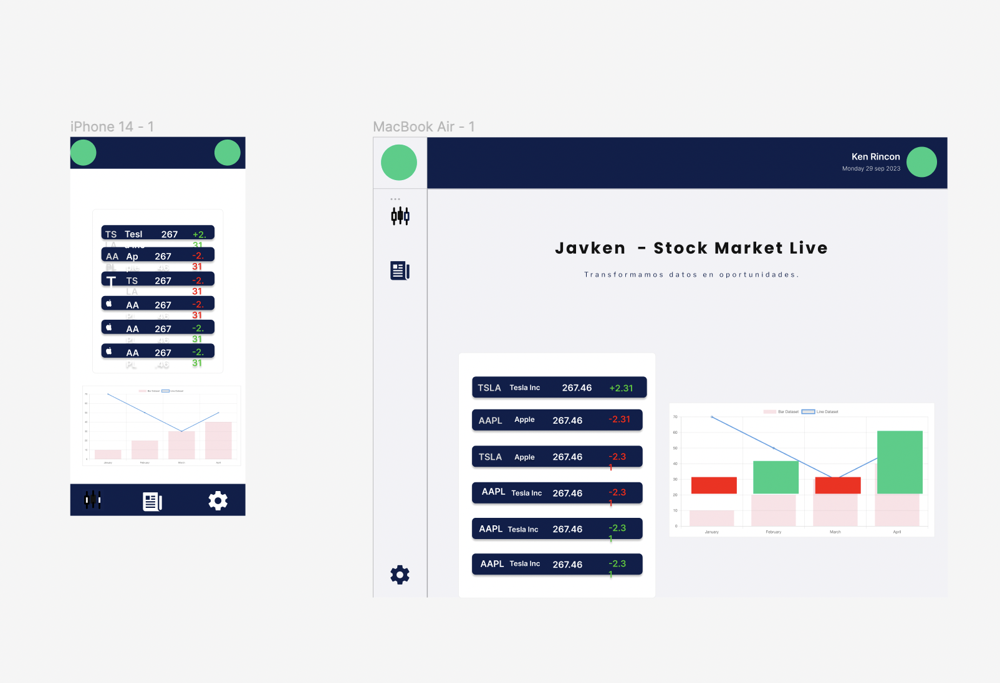

# Dashboard

En este proyecto estamos analizando nuestras 3 empresas favoritas que estan en los Mercados Financieros.

Fue un gran reto entender que tipos de datos debiamos mostrar porque aunque conocemos estas compañias no sabiamos nada sobre los mercados financieros pero con un poco de research pudimos lograr los resultados que podra ver en el UI

## Sobre El Proyecto 

Estamos Usando https://www.stockdata.org/documentation para nuestro proyecto.

Para Ver el chart de cada empresa simplemente se le da Click en la cajita de datos de la empresa deseada.

La API que decidimos usar solo nos da 100 llamados por dia y solo podiamos llamar 3 empresas.

En caso de que haga mas de 100 llamados aqui hay algunas url nuevas con diferentes API KEY:

### Para la caja que muestra las 3 empresas:
`https://api.stockdata.org/v1/data/quote?symbols=%2CTSLA%2CMSFT&api_token=4icw5TsyauRdPZCa7UKoxdUieoizFy26GbPDOb5g`;

`https://api.stockdata.org/v1/data/quote?symbols=AAPL,TSLA,MSFT&api_token=gq1sFgR9jNPSXzEjCsYFonsVIiO0jtLh76MnPFGM`;

`https://api.stockdata.org/v1/data/quote?symbols=AAPL,TSLA,MSFT&api_token=rRi0Uh73qccC4z1jLDScJWpEmIiKArhw8DCuTets`;

 `https://api.stockdata.org/v1/data/quote?symbols=AAPL,TSLA,MSFT&api_token=ZK9EP6e3w2Pj9WdyCTTJYIz8EjuYPUJaEtHbVHl2`;
 
 `https://api.stockdata.org/v1/data/quote?symbols=AAPL,TSLA,MSFT&api_token=W85YBIrstjB4LLr9EDlPK9LUwtcqAzey7CPeEr3o`;

### Para el chart 
(`https://api.stockdata.org/v1/data/eod?symbols=TSLA&api_token=ZkibrAspSTxzw4ysxWgmcEy4IssnIh3XXpsghA5i`);

 (` https://api.stockdata.org/v1/data/eod?symbols=${symbol}&api_token=eNwylMhuthKzubM7xLiTc384o6VDVMz2dNTLlHr5`);

 (`https://api.stockdata.org/v1/data/eod?symbols=${symbol}&interval=week&api_token=Nq9FmwkD0tyfJBJM6uJMNZmKdsfbJZCLJOkVAsCK`);

(`https://api.stockdata.org/v1/data/eod?symbols=${symbol}&interval=week&&api_token=W85YBIrstjB4LLr9EDlPK9LUwtcqAzey7CPeEr3o`);

# MockUp

